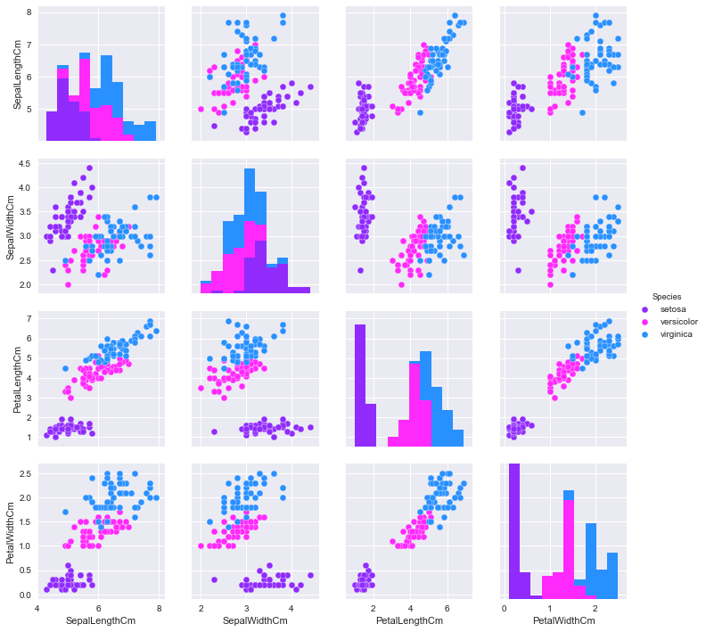
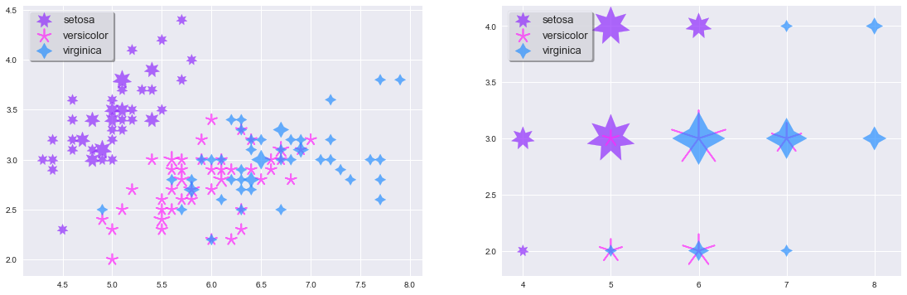
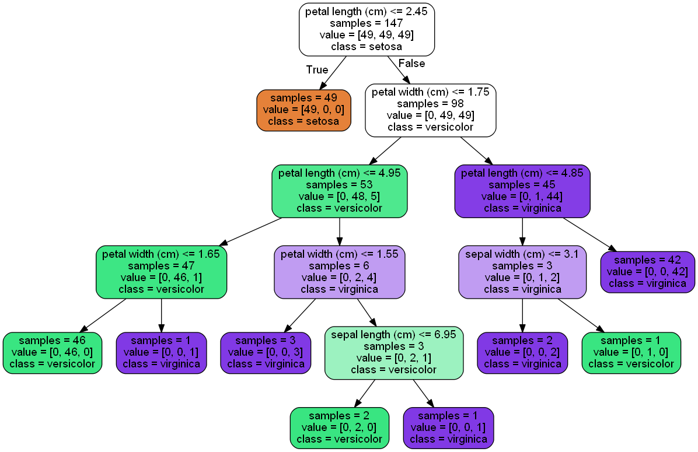

```python
import sqlite3
import pandas as pd
import matplotlib.pyplot as plt
import seaborn as sns
%matplotlib inline
from pylab import rcParams
rcParams['figure.figsize'] = 12, 7
```


```python
color_scheme = dict(setosa='#902BFC', versicolor='#FF29FB', virginica='#2990FF')
#color_scheme = ('#902BFC', '#FF29FB', '#2990FF')
```


```python
conn = sqlite3.connect('database.sqlite')
cursor = conn.cursor()
cursor.execute("SELECT name FROM sqlite_master WHERE type='table';")
print(cursor.fetchall())
```

    [('Iris',)]
    


```python
sql = "SELECT * FROM Iris"
iris_df = pd.read_sql(sql, conn)
iris_df.Species = iris_df.Species.str.replace('Iris-','')
iris_df.head()
```


<div>
<style>
    .dataframe thead tr:only-child th {
        text-align: right;
    }

    .dataframe thead th {
        text-align: left;
    }

    .dataframe tbody tr th {
        vertical-align: top;
    }
</style>
<table border="1" class="dataframe">
  <thead>
    <tr style="text-align: right;">
      <th></th>
      <th>Id</th>
      <th>SepalLengthCm</th>
      <th>SepalWidthCm</th>
      <th>PetalLengthCm</th>
      <th>PetalWidthCm</th>
      <th>Species</th>
    </tr>
  </thead>
  <tbody>
    <tr>
      <th>0</th>
      <td>1</td>
      <td>5.1</td>
      <td>3.5</td>
      <td>1.4</td>
      <td>0.2</td>
      <td>setosa</td>
    </tr>
    <tr>
      <th>1</th>
      <td>2</td>
      <td>4.9</td>
      <td>3.0</td>
      <td>1.4</td>
      <td>0.2</td>
      <td>setosa</td>
    </tr>
    <tr>
      <th>2</th>
      <td>3</td>
      <td>4.7</td>
      <td>3.2</td>
      <td>1.3</td>
      <td>0.2</td>
      <td>setosa</td>
    </tr>
    <tr>
      <th>3</th>
      <td>4</td>
      <td>4.6</td>
      <td>3.1</td>
      <td>1.5</td>
      <td>0.2</td>
      <td>setosa</td>
    </tr>
    <tr>
      <th>4</th>
      <td>5</td>
      <td>5.0</td>
      <td>3.6</td>
      <td>1.4</td>
      <td>0.2</td>
      <td>setosa</td>
    </tr>
  </tbody>
</table>
</div>


```python
sns.pairplot(iris_df[iris_df.columns[[1,2,3,4,5]]], hue='Species', 
             palette = color_scheme)
```


    <seaborn.axisgrid.PairGrid at 0x1fd12854fd0>





```python
ax0_df = iris_df.groupby(['Species','SepalLengthCm','SepalWidthCm']).size().
reset_index(name='cnt')

setosa = ax0_df[ax0_df.Species == 'setosa']
versicolor = ax0_df[ax0_df.Species == 'versicolor']
virginica = ax0_df[ax0_df.Species == 'virginica']

fig, axes = plt.subplots(1,2, figsize=(19,6))
# First plot 
marker_size = 180
l1 = axes[0].scatter(x=setosa.SepalLengthCm, y=setosa.SepalWidthCm, c ='#902BFC', s=setosa.cnt*marker_size,alpha = .7, marker = (7,1))
l2 = axes[0].scatter(x=versicolor.SepalLengthCm, y = versicolor.SepalWidthCm, c ='#FF29FB', s=versicolor.cnt*marker_size,  alpha = .7, marker = (5,2))
l3 = axes[0].scatter(x=virginica.SepalLengthCm, y = virginica.SepalWidthCm, c ='#2990FF', s=virginica.cnt*marker_size,  alpha = .7, marker=(4,1))
axes[0].legend([l1,l2,l3], ['setosa','versicolor','virginica'], loc=2, fontsize=13, frameon=True, shadow=True)

# Second plot - Round dimensions
ax0_df.SepalLengthCm = ax0_df.SepalLengthCm.round()
ax0_df.SepalWidthCm = ax0_df.SepalWidthCm.round()
ax1_df = ax0_df.groupby(['Species','SepalLengthCm','SepalWidthCm']).size().reset_index(name='cnt')
setosa = ax1_df[ax1_df.Species == 'setosa']
versicolor = ax1_df[ax1_df.Species == 'versicolor']
virginica = ax1_df[ax1_df.Species == 'virginica']
leg = axes[1].legend([l1,l2,l3], ['setosa','versicolor','virginica'], loc=2, fontsize=13, frameon=True, shadow=True)
marker_size = 200

l1 = axes[1].scatter(x=setosa.SepalLengthCm, y=setosa.SepalWidthCm, c ='#902BFC', s=setosa.cnt*marker_size, alpha = .7, marker = (7,1))
l2 = axes[1].scatter(x=versicolor.SepalLengthCm, y = versicolor.SepalWidthCm, c ='#FF29FB', s=versicolor.cnt*marker_size,  alpha = .7, marker = (5,2))
l3 = axes[1].scatter(x=virginica.SepalLengthCm, y = virginica.SepalWidthCm, c ='#2990FF', s=virginica.cnt*marker_size,  alpha = .7, marker=(4,1))


```





```python
from sklearn.datasets import load_iris
from sklearn import tree
from sklearn.externals.six import StringIO
import numpy as np
import pydotplus
from IPython.display import Image  

iris = load_iris()
print (iris.feature_names)
print (iris.target_names)
print(iris.data[0])
print(iris.target[0])

for i, item in enumerate(iris.target):
    print("Example %d: label %s, features %s"%(i, item, iris.data[i]))
    if i == 5: break
```

    ['sepal length (cm)', 'sepal width (cm)', 'petal length (cm)', 'petal width (cm)']
    ['setosa' 'versicolor' 'virginica']
    [ 5.1  3.5  1.4  0.2]
    0
    Example 0: label 0, features [ 5.1  3.5  1.4  0.2]
    Example 1: label 0, features [ 4.9  3.   1.4  0.2]
    Example 2: label 0, features [ 4.7  3.2  1.3  0.2]
    Example 3: label 0, features [ 4.6  3.1  1.5  0.2]
    Example 4: label 0, features [ 5.   3.6  1.4  0.2]
    Example 5: label 0, features [ 5.4  3.9  1.7  0.4]
    


```python
test_idx = [0,50,100]

#training data
train_target = np.delete(iris.target, test_idx)
train_data = np.delete(iris.data, test_idx, axis = 0)

test_target = iris.target[test_idx]
test_data = iris.data[test_idx]

clf = tree.DecisionTreeClassifier()
clf.fit(train_data, train_target)

print(test_target)
print(clf.predict(test_data))
```

    [0 1 2]
    [0 1 2]
    


```python
dot_data = StringIO()
tree.export_graphviz(clf, 
                     out_file = dot_data,
                     feature_names = iris.feature_names,
                     class_names = iris.target_names,
                     filled = True, rounded = True, impurity=False        
                    )

graph = pydotplus.graph_from_dot_data(dot_data.getvalue())
#graph.write_pdf('iris.pdf')
Image(graph.create_png())  
#help(graph)
```





```python
from sklearn import datasets
iris = datasets.load_iris()

x = iris.data
y = iris.target

from sklearn.cross_validation import train_test_split
x_train, x_test, y_train, y_test = train_test_split(x, y, test_size = .5)
```


```python
from sklearn import tree
my_classifier = tree.DecisionTreeClassifier()

my_classifier.fit(x_train, y_train)

predictions = my_classifier.predict(x_test)

from sklearn.metrics import accuracy_score
print(accuracy_score(y_test, predictions))
```

    0.933333333333
    


```python
from scipy.spatial import distance

def euc(a,b):
    return distance.euclidean(a,b)

class ScrapyKNN():
    def fit(self, x_train, y_train):
        self.x_train = x_train
        self.y_train = y_train
    
    def predict(self, x_test):
        predictions = []
        for row in x_test:
            label = self.closest(row)
            predictions.append(label)
        return predictions
    
    def closest(self, row):
        best_dist = euc(row, self.x_train[0])
        best_index = 0
        for i in range(1, len(self.x_train)):
            dist = euc(row, self.x_train[i])
            if dist < best_dist:
                best_dist = dist
                best_index = i
        return self.y_train[best_index]

#from sklearn.neighbors import KNeighborsClassifier
my_classifier = ScrapyKNN()

my_classifier.fit( x_train, y_train)

predictions = my_classifier.predict(x_test)

from sklearn.metrics import accuracy_score
print(accuracy_score(y_test, predictions))
```

    0.96
    
